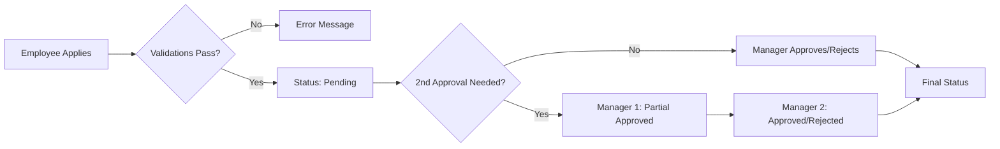

# Leave Service Business Logic Documentation

## Overview
Comprehensive documentation of all leave management business logic implemented in `app/services/leave/`. The leave system handles leave applications, approvals, balance tracking, and various leave types with complex validation rules.

---

## Service Files

### 1. leave_query_service.py
**Purpose**: Handles all leave-related data retrieval and queries
**Methods**: 11 query operations

### 2. leave_transaction_service.py
**Purpose**: Manages leave transaction creation and updates
**Methods**: 5 transaction operations

### 3. leave_config_service.py
**Purpose**: Manages holiday configuration
**Methods**: 2 configuration operations

### 4. leave_utils.py
**Purpose**: Utility functions for leave calculations
**Methods**: 1 utility function

---

## Leave Query Service

### 1. get_leave_types_and_approver(employee_id)
**Purpose**: Retrieves available leave types and approver for an employee

**Logic**:
- Fetches all leave types from `master_leave_types` table
- Returns leave type ID and name
- Gets employee's team lead as approver
- Returns both as dictionary

**Response**:
```json
{
  "leave_types": [{"id": 1, "name": "Sick/Emergency Leave"}, ...],
  "approver": "EMP123"
}
```

---

### 2. get_employee_leave_cards(employee_id)
**Purpose**: Retrieves leave balance summary cards for employee

**Complex Logic**:
1. **Financial Year Calculation**:
   - Sick/WFH: Uses FY 2025-2026 (Apr 2025 - Mar 2026)
   - Other leaves: Uses FY 2024-2025 (Apr 2024 - Mar 2026)

2. **Opening Balance** (`LeaveOpeningTransaction`):
   - Groups by leave type
   - Filters by transaction date based on leave type
   - Sums allocated days

3. **Used Leaves** (`LeaveAudit`):
   - Groups by leave type
   - Filters by leave status (excludes Cancelled/Rejected)
   - Excludes specific transaction IDs: [10598, 10599, 10601, 10618, 10634]
   - Calculates absolute value for safety

4. **Final Calculation**:
   - Only leaves with `leave_cards_flag = 1` are shown
   - Returns: alloted, used, leave name, type ID, joining date

**Response**:
```json
[
  {
    "employee": "EMP001",
    "leave_type_id": "1",
    "leave_name": "Sick/Emergency Leave",
    "total_alloted_leaves": 8.0,
    "total_used_leaves": 2.0,
    "leave_cards_flag": 1,
    "date_of_joining": "01 Apr 2024"
  }
]
```

---

### 3. get_leave_details(employee_id, year)
**Purpose**: Retrieves leave transaction history for financial year

**Logic**:
- Calculates financial year dates (Mar 31 to Mar 31)
- Joins: `LeaveTransaction` → `Employee` → `MasterLeaveTypes`
- Handles multi-level approvals:
  - If `is_for_second_approval = True` and `second_approval_date` exists:
    - Uses `second_approval_by` and `second_approval_comment`
  - Otherwise uses `approved_by` and `approval_comment`
- Formats dates as "DD MMM YYYY"
- Orders by transaction ID descending (newest first)

**Response Fields**:
- leave_tran_id, emp_name, description
- leave_name, duration, from_date, to_date
- applied_leave_count, number_of_days
- application_date, leave_status
- approved_by, approval_comment
- is_communicated_to_team, is_customer_approval_required

---

### 4. get_all_employee_leave_records(year)
**Purpose**: Retrieves comprehensive leave records for all employees

**Complex Calculations**:
1. **Opening Balance Subquery**:
   - Aggregates opening balances per employee per leave type
   - Filters by financial year

2. **Leave Audit Subquery**:
   - Aggregates used leaves (negative values)
   - Groups by employee and leave type

3. **Carry Forward Subquery**:
   - Calculates: `opening_days + audit_days` for each leave type
   - Sums for: Sick Leave (type 1), Privilege (type 2), WFH (type 3)
   - Filters by `leave_cards_flag = True`

4. **Main Query**:
   - Joins all subqueries with employee data
   - Returns: employee name, leave type, dates, approver
   - Includes carry forward balances for each leave type

**Use Case**: HR dashboard showing all employee leave balances and transactions

---

### 5. get_leave_transaction_details(leave_tran_id, approved_by)
**Purpose**: Retrieves detailed transaction info for email notifications

**Logic**:
- Fetches complete leave transaction details
- Gets employee information
- Retrieves comp-off dates if applicable (leave type 4)
- Gets customer holiday worked dates if applicable (leave type 6)
- Gets working late times if applicable (leave type 7)
- Used for email generation when notifying approvers/employees

---

### 6. get_employee_roles(employee_id)
**Purpose**: Retrieves all roles assigned to an employee

**Logic**:
- Joins `EmployeeRole` → `MasterRole`
- Returns role IDs and role names
- Used for authorization checks

---

### 7. get_leave_transactions_by_team_lead(team_lead_id, year)
**Purpose**: Retrieves all leaves requiring team lead approval

**Logic**:
- Filters leaves where `approved_by = team_lead_id`
- Within financial year
- Calculates balance for each leave type
- Shows pending, approved, and rejected leaves
- Used in Team Leave Management dashboard

---

## Leave Transaction Service

### 1. insert_leave_transaction(data)
**Purpose**: Main function to insert leave with comprehensive validations

**Validations**:

#### Work From Home (Type 3) Validations:
1. **5-Day WFH Rule**:
   - If applying for ≥5 days WFH
   - Checks if already took 5-day WFH in last 6 months
   - Error if gap is <180 days

2. **Joining Date Rule**:
   - Non-lateral hires joining after Aug 30, 2024
   - Cannot apply WFH before 12 months of joining

3. **Application Date Check**:
   - Cannot apply WFH if application date > from date (retroactive)

4. **Weekly Limit**:
   - Cannot take any WFH if already took 5-day WFH in same week
   - If taking >1 WFH in a week:
     - Requires 1 week advance notice
     - Flags for 2nd level approval

#### Privilege Leave (Type 2) Validations:
1. **Advance Notice**:
   - Must apply at least 7 days in advance
   - Error if `(from_date - application_date) < 7 days`

**Transaction Creation**:
- Generates new `leave_tran_id` from sequence
- Sets application date to IST (UTC + 5:30)
- Sets status to "Pending"
- Sets `is_for_second_approval` flag based on validations
- Returns transaction ID

---

### 2. update_leave_status(leave_tran_id, status, ...)
**Purpose**: Updates leave approval status with multi-level logic

**Multi-Level Approval Logic**:

#### For CompOff, Working Late, or 2nd Approval Required:
1. **First Approval** (Pending → Partial Approved):
   - Sets `leave_status = "Partial Approved"`
   - Records: approval_comment, approved_date, approved_by
   - Sets: is_billable, is_communicated_to_team flags
   - `send_mail_flag = 2` (notify 2nd approver)

2. **Second Approval** (Partial Approved → Approved/Rejected):
   - Sets `leave_status = Approved/Rejected`
   - Records: second_approval_comment, second_approver_date
   - `send_mail_flag = 1` (notify employee)

#### For Normal Leaves:
- Single-level approval
- Updates status, approval comment, approved date
- `send_mail_flag = 1` (notify employee)

**Returns**: (message, send_mail_flag)

---

### 3. insert_comp_off_transaction(...)
**Purpose**: Inserts compensatory off leave with worked dates

**Logic**:
- Creates leave transaction with `is_for_second_approval = 1`
- Inserts multiple `CompensatoryOff` records for each worked date
- Each comp-off record includes:
  - `comp_off_date`: Date worked
  - `comp_off_time`: Hours worked
  - `is_used = 1`: Marks as utilized for this leave
- Requires 2-level approval

**Data Structure**:
```json
{
  "comp_off_transactions": [
    {
      "CompOffDate": "2025-05-01",
      "CompOffTime": 8.0
    }
  ]
}
```

---

### 4. insert_customer_holiday(...)
**Purpose**: Inserts customer holiday leave

**Logic**:
- Creates leave transaction with status "Pending"
- Inserts `CustomerHoliday` record with `worked_date`
- `worked_date`: Date employee worked on customer's holiday
- Allows employee to take equivalent compensatory time off

---

### 5. insert_working_late(...)
**Purpose**: Records working late hours

**Logic**:
- Creates leave transaction with status "Pending"
- Inserts `WorkingLate` record with:
  - `from_time`: Start time of late work
  - `to_time`: End time of late work
  - `reason_for_working_late`: Justification
- Used for attendance/overtime tracking

---

## Leave Config Service

### 1. get_holidays()
**Purpose**: Retrieves active holidays

**Logic**:
- Filters holidays where `is_deleted = False`
- Returns holidays from:
  - Current year (Jan 1 to Dec 31)
  - OR next 3 months (for planning)
- Ensures no extremely old holidays
- Orders by date ascending

**Use Case**:
- Leave calendar display
- Calculating working days
- Leave date validation

---

### 2. insert_holiday(holiday_date, holiday_name)
**Purpose**: Adds new holiday to calendar

**Logic**:
- Creates new `Holiday` record
- Sets audit fields automatically (created_at, created_by)
- Returns success/failure boolean

---

## Leave Utils

### get_financial_year_dates(year)
**Purpose**: Calculates financial year start and end dates

**Logic**:
- Financial year: March 31 (year) to March 31 (year+1)
- Example: FY 2024 = Mar 31, 2024 to Mar 31, 2025
- Used throughout leave calculations for date filtering

---

## Leave Type IDs (Constants)

| ID | Leave Type | Requires 2nd Approval | Notes |
|----|-----------|----------------------|-------|
| 1 | Sick/Emergency Leave | No | Unpaid if balance exhausted |
| 2 | Privilege Leave | No | 7-day advance notice |
| 3 | Work From Home | Conditional | >1/week needs approval |
| 4 | Customer Approved Comp-off | Yes | Requires comp-off dates |
| 5 | Customer Approved WFH | Yes | Customer approval needed |
| 6 | Customer Holiday | No | Requires worked date |
| 7 | Working Late Today | Yes | Requires time range |
| 8 | Visiting Client Location | No | - |
| 14 | Missed Door Entry | No | Quarterly limit: 3 |

---

## Leave Status Flow



**Status Values**:
- `Pending`: Awaiting approval
- `Partial Approved`: First approval done, awaiting 2nd
- `Approved`: Fully approved
- `Rejected`: Denied by approver
- `Cancel`: Cancelled by employee

---

## Key Business Rules

### 1. Financial Year Handling
- Different leave types use different FY ranges
- Sick/WFH: Current FY only
- Privilege: Carries forward from previous FY

### 2. Balance Calculations
```
Available Balance = Opening Balance - Used Leaves
```

### 3. Working Days Calculation
- Excludes weekends (Saturday, Sunday)
- Excludes public holidays
- Counts only business days

### 4. Multi-Level Approval Triggers
- WFH: >1 day in same week with <7 days notice
- Comp-Off: Always requires 2 levels
- Working Late: Always requires 2 levels

### 5. Retroactive Applications
- WFH: Not allowed (application date cannot > from date)
- Other leaves: Allowed with manager discretion

---

## Error Handling

All services implement:
- **Try-Catch blocks** for database errors
- **Structured logging** with context (employee_id, transaction_id, error details)
- **Transaction rollback** on failure
- **Specific validation messages** for business rule violations

**Log Levels**:
- `INFO`: Successful operations
- `WARNING`: Expected issues (employee not found)
- `ERROR`: Database/unexpected errors
- `CRITICAL`: Severe failures requiring attention

---

## Integration Points

### 1. Email Notifications
- Triggered by `send_mail_flag` from `update_leave_status`
- Uses `get_leave_transaction_details` to fetch email content
- Sends to:
  - Employee (on approval/rejection)
  - 2nd Approver (on partial approval)

### 2. Frontend APIs
- `/leave/leave-types-and-approver` → `get_leave_types_and_approver`
- `/leave/leave-cards` → `get_employee_leave_cards`
- `/leave/leave-details` → `get_leave_details`
- `/leave/insert` → `insert_leave_transaction` (or specialized variants)
- `/leave/update-status` → `update_leave_status`

### 3. Dashboard Data
- Employee Dashboard: `get_employee_leave_cards`, `get_leave_details`
- Team Lead Dashboard: `get_leave_transactions_by_team_lead`
- HR Dashboard: `get_all_employee_leave_records`

---

## Database Tables Used

| Table | Purpose |
|-------|---------|
| `employee` | Employee master data |
| `master_leave_types` | Leave type configuration |
| `leave_transaction` | Main leave records |
| `leave_opening_transaction` | Opening balances |
| `leave_audit` | Used leave tracking |
| `compensatory_off` | Comp-off worked dates |
| `customer_holiday` | Customer holiday worked dates |
| `working_late` | Late working hours |
| `holiday` | Public holidays |
| `employee_role` | Employee roles |
| `lateral_and_exempt` | Special employee flags |

---

## Performance Considerations

1. **Indexed Queries**: All employee_id and date range queries use indexes
2. **Subqueries**: Used for complex aggregations to avoid multiple round trips
3. **Financial Year Filtering**: Limits data scope for better performance
4. **Sequence Generation**: Uses SQL Server sequences for ID generation

---

## Future Enhancements

While reviewing the code, potential areas for enhancement:
- [ ] Make financial year dates configurable (currently hardcoded)
- [ ] Extract validation rules to configuration
- [ ] Add leave type-specific validation plugins
- [ ] Implement leave carry forward automation
- [ ] Add bulk leave import functionality
